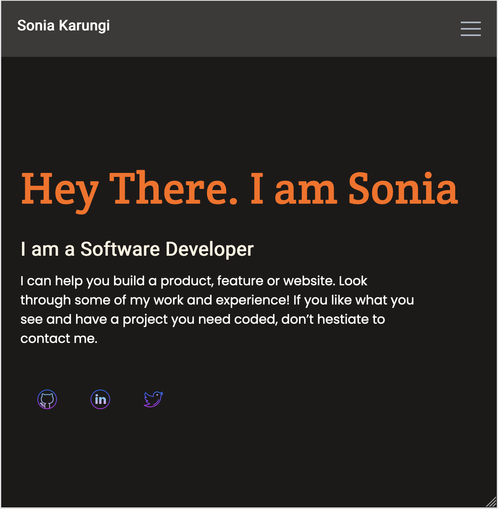

 

# Portfolio: setup and mobile version skeleton

> The goal of this project is to create the UI from the templates in Figma. I chose template 3.

## Built With

- HTML
- CSS

## Live Demo

[Live Demo Link](https://SoniaKarungi.github.io/Portfolio)

## Getting Started

To get a local copy up and running follow these simple example steps.

- Clone this repository to your local machine
- git clone https://github.com/SoniaKarungi/Portfolio.git
- cd Portfolio
- Open `index.html` file in a browser of your choice

## Authors

👤 **Author1**

- GitHub: [@SoniaKarungi](https://github.com/SoniaKarungi)
 
